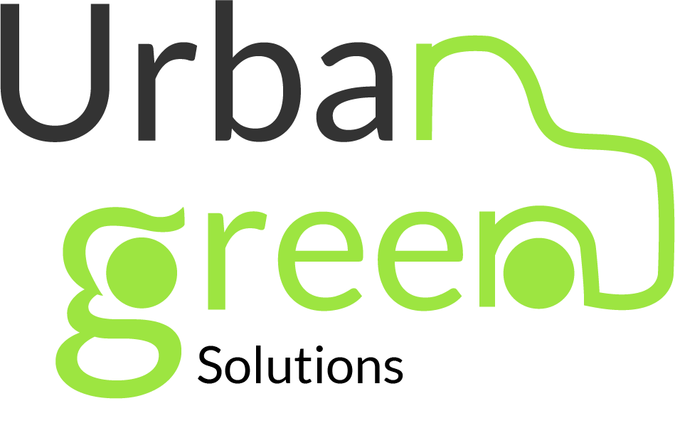

# ``` | ✏️ APP - BlueTrips ✏️ | ✏️ Urban Green Solutions ✏️ | 🟢 Data Scientist 🟢|🔵 Data Engineer 🔵|🟢 Data Analytics 🟢|🔵 Business Intelligence 🔵|🟢 Cloud Arquitect 🟢|🔴 Taxis NY 🔴 | 🚀 Henry 🚀 ```


<p align=center><p>

<p align="center">

</p>


# ```🚕🚖 Blue Trips: Revolucionando la Movilidad en Nueva York con Vehículos Eléctricos Compartidos 🚖🚕``` 


## 🔷Descripción del Proyecto
Blue Trips es una iniciativa que busca transformar el transporte urbano en Nueva York mediante la introducción de una flota de vehículos eléctricos compartidos. Nuestro enfoque está en ofrecer un servicio innovador, flexible y sostenible que aproveche las ventajas de los vehículos eléctricos, en particular en aeropuertos y zonas con alta demanda de movilidad. Nos proponemos no solo reducir el impacto ambiental, sino también generar una propuesta de valor rentable y alineada con el marco regulatorio de la ciudad.


## 🔷Contexto
Nueva York cuenta con miles de taxis en servicio continuo, regulados por licencias estrictas y restricciones operativas según la zona de la ciudad. Los taxis tradicionales, como los amarillos, enfrentan dificultades significativas debido a sus altos costos operativos y al aumento de la competencia con servicios como Uber. Además, la crisis ambiental ha impulsado políticas que favorecen la adopción de vehículos eléctricos, con el objetivo de renovar el parque automotor antes de 2025.
Ante este escenario, surge Blue Trips, un servicio que aprovecha la flexibilidad de la normativa para los vehículos eléctricos y se posiciona como una solución ecológica y económicamente viable en el competitivo mercado del transporte de Nueva York.


# ✔️``Objetivos del Proyecto``
## 🔷Objetivo Principal:
- Crear un servicio de vehículos compartidos eléctricos que se integre al mercado actual de transporte en Nueva York, con un enfoque en la sostenibilidad y la rentabilidad.

## 🔷Objetivos Específicos:
1.	Análisis de vehículos óptimos: Identificar los vehículos eléctricos más adecuados para el negocio, considerando aspectos de rendimiento y rentabilidad.
2.	Planificación de rentabilidad: Evaluar la viabilidad económica de un servicio de taxis compartidos eléctricos, considerando la estructura de costos y precios del mercado.
3.	Sistema de recomendación para viajes compartidos: Desarrollar un sistema de recomendación inteligente que optimice los viajes compartidos, basándose en puntos de inicio y destino comunes entre los usuarios.


# ✔️``Nuestra Solución``
🔹  Blue Trips introduce un servicio de taxis compartidos eléctricos, comenzando con operaciones en los aeropuertos de Nueva York (JFK, LaGuardia y Newark). Esta unidad de negocio se diferencia de los taxis tradicionales al:

- Operar bajo una reglamentación menos restrictiva, permitiendo una mayor flexibilidad en las zonas de operación.
- Reducir significativamente el impacto ambiental mediante el uso de vehículos eléctricos que minimizan las emisiones y el ruido.
- Beneficiarse de incentivos gubernamentales, como créditos fiscales y subsidios estatales, que facilitan la adquisición de flota y mejoran la rentabilidad.

🔹 Ventajas Competitivas:

- Costos operativos más bajos: Gracias al uso de energía eléctrica, se reducen los gastos en combustible y mantenimiento.
- Mayor flexibilidad: Los vehículos eléctricos compartidos no enfrentan las mismas restricciones de operación que los taxis tradicionales, lo que permite una mayor cobertura en zonas estratégicas de la ciudad.
- Incentivos gubernamentales: Descuentos y créditos fiscales de hasta $9,500 por vehículo eléctrico facilitan la adquisición de la flota y mejoran la rentabilidad del negocio.
Público Objetivo

🔹 El servicio está diseñado para:
- Pasajeros de aeropuertos: Turistas y viajeros frecuentes que buscan soluciones de transporte flexibles, económicas y sostenibles.
- Ciudadanos locales: Residentes que prefieren opciones de transporte más ecológicas y con menores tiempos de espera.


# ✔️```Ciclo de vida del dato``` 
Conocer cual es el camino que siguen los datos dentro de cualquier proyecto es crucial para entender su procedencia y aprovechar al máximo su presencia, por ello se presenta un gráfico que indica a detalle los caminos a seguir de los diferentes datos que ayudan a sustentar el presente proyecto por ello se explica el proceso a coninuación:

## 🔷Explicación del ciclo de vida completo en la nube
- Ingesta de datos: Los datos crudos se cargan automáticamente en Cloud Storage o se leen de APIs mediante Cloud Functions.
- Transformación y carga: Usando Cloud Composer y Dataflow, los datos se limpian, transforman y cargan en BigQuery.
- Validación de datos: Airflow orquesta la ejecución de las tareas y realiza verificaciones automáticas para asegurar la integridad de los datos.
- Almacenamiento: Los datos transformados se almacenan en BigQuery para su uso en análisis, ML o dashboards.
- Machine Learning: Los modelos se entrenan localmente o en AI Platform, luego se despliegan como servicios para ser usados en aplicaciones.
- Dashboards: se realiza conexión cn power bi a ttabves de BigQuery para su ingesta y su posterior análisis.


# 1. ✔️```Análisis preliminar de la calidad de los datos (EDA)``` 

Bajo la misma línea de pensamiento de Urban Green Solutions, sin perder de vista los objetivos planteados en el proyecto y con la finalidad de obtener un panorama real del estado y los retos a los que nos enfrentamos, se realiza un análisis preliminar de los datos:
Para ello se extraen de las Agencias gubernamentales NYC Taxi and Limousine Comisión y Environment & Health de New York datos reales y actuales útiles para trabajar este proyecto.


El análisis consta de 6 sets de datos:

🔹 **Electric and Alternative Fuel Charging Stations:** Este dataset contiene información sobre las estaciones de carga de combustibles alternativos para vehículos (electricidad, Gas Natural, Gas Licuado, Gas de biodigestores, Etanol e hidrógeno) en EE.UU., después de analizar los datos se obtuvieron los siguientes insights:
    - Existen gran cantidad de nulos por columnas especificas de cada tipo de combustible, sin existir problema filtrando data.
    - Casi 60k estaciones son destinadas para todo publico
    - Mas de 45k estaciones abren las 24 horas 
    - Mas de 10k estaciones de carga ofrecen carga de vehículos eléctricos de forma gratuita y otras más solo cobran tiempo de estacionamiento
    - En NY existe un total de 3409 estaciones de carga para vehículos eléctricos y mas de 600 ofrecen servicio gratuito. 17%.


🔹 **Vehículos ligeros:** Este dataset contiene información adicional de 1993 a 2022 sobre vehículos ligeros (autos a camionetas hasta 2.7 ton) en él se almacenan datos referentes a tipo de combustible eficiencia de combustible alternativo (ciudad, carretera y combinado), los datos más importantes son:
    - La fábrica predominante es Ford
    - La categoría de estos vehículos predominante es sedan/wagon y le sigue SUV
    - Casi 15% son vehículos eléctricos.


🔹 **Electric Car Data:** Con la finalidad de apegarse a la normativa en NY, se analiza este set de datos que contiene la información de los autos eléctricos disponibles en el mercado de EE.UU. La información relevante contenida es:
    - No existen datos nulos 
    - Existen información de marca, modelo, eficiencia, autonomía, Precio, entre otras 
    - Existen outliers en eficiencia y precio


🔹 **Taxy-zones:** Con la finaldad de estudiar y conocer las zonas en donde transitan los taxis en NY se analiza este dataset, el mismo contiene la siguiente información: 
    - Las ciudades de New York
    - Áreas o espacios de zonas de taxis
    - Longitud de recorridos
    - Zonas de aeropuertos


🔹 **Vehicle fuel Economy Data:** Este dataset contiene información acerca de la economía y emisiones de CO2 del combustible tradicional y alternativo en un periodo comprendido de 1984 a 2023. La relevancia de los datos es:
    - 120 gr/milla de emisiones en promedio por auto de combustible tradicional contra 0 gr/milla de vehículos electricos
    - Casi $3k dólares contra $15.36 el promedio de comparación de costos de combustibles


🔹 **AirQuality:** Calidad del aire: Dentro de este dataset se encuentran valores que miden la calidad del aire de acuerdo a una tabla con la cual se compara la concentración de contaminantes, medidos en µg/m3, así como registros de temporalidad por hora, día, mes y de requerir por año. Junto a este set de datos se analizan datos que contiene información sobre las ubicaciones de las mediciones:
    - No nulos
    - Valor máximo: 265.21
    - Valor mínimo: 2.19
    - Promedio: 9.88
    - Asimismo, se pudo observar que los horarios del día en que existe menor calidad de aire son de 12 a 17 horas


🔷 **Conclusión:**  
    Confiabilidad: 
        - Alta por venir de organismos públicos
    Problemas detectados: 
        - Gran cantidad de datos tiene nulos, solo en algunos datasets por ser datos de vehículos específicos
        - Buena variabilidad:

Para una mejor visualización de los análisis preliminares a detalle se sugiere ver en los notebooks del EDA [link EDA](https://github.com/UrbanGreenSolutions/BlueTrips/tree/main/EDAs), los datos nos entregan información elocuente sobre tipo de tenologías convencionales y alternativas, su disponibilidad en la cuidad, tipo de vehículos por modelo, eficiencia y costos, como también el funcionamiento convencional del servicio.

# 2. ✔️```Extracción transformación y Carga (ETL)``` 
El proceso de ETL es crucial puesto que permitirá alimentar la aplicación de todos los datos necesarios para llevar a cabo su respectivo análisis. El proyecto en esta etapa integra los set de datos al entorno de GCP, mediante una estracción de datos del DataLake de los organismos públicos antes mencionados, posteriormente se realiza una limpieza profunda de los datos que son indispensables para la unidad de negocio y respecto a las decisiones tomadas, los datos extraidos, filtrados y limpiados pasan a cargarse en la tecnología Big Query de GCP, con ello pueden ser consumidos desde otros entornos, herramientas y visualizaciones para satisfacer las necesidades del cliente final.

🔷 **Estructura de la DB:**  
La base de datos que se construye es muy importante así como su estructura por lo que darla a conocer es medular en el proyecto, a continuación se muestra la estructura de esta Base de Datos construida:


# 3. ✔️```Modelos de Machine Learning``` 

En el proyecto de la nueva unidad de negocio de vehículos compartidos eléctricos, se plantea desarrollar un modelo de machine learning específicamente diseñado para medir el Retorno de Inversión (ROI). Este modelo se enfocará en analizar los ingresos y costos asociados a la operación de la flota de vehículos eléctricos, con el objetivo de ofrecer una evaluación precisa del desempeño financiero del proyecto.

El desarrollo de este modelo implica la recopilación y análisis de datos clave, como los ingresos generados por los servicios de transporte, los costos operativos (mantenimiento de los vehículos, costos de energía eléctrica, infraestructura de carga), así como los costos iniciales de inversión en la flota y otros gastos asociados. Además, se incluirán factores como la demanda estacional del servicio, patrones de uso, zonas con mayor actividad y variables externas que puedan afectar la operación, como cambios en las regulaciones o incentivos fiscales.

La razón principal para implementar este modelo es que permitirá al cliente tener una visión detallada y cuantificable del rendimiento financiero de la inversión en tiempo real. En lugar de realizar estimaciones o proyecciones estáticas, el uso de machine learning permitirá ajustar las predicciones a medida que se reciban nuevos datos, proporcionando una evaluación dinámica del ROI. 

Otro aspecto clave del modelo será su capacidad de realizar proyecciones a futuro. Esto permitirá no solo evaluar el ROI actual, sino también predecir cómo se comportará en distintos escenarios, como la expansión de la flota, el aumento de la demanda, o cambios en las condiciones del mercado. De esta manera, el cliente podrá planificar estratégicamente sus inversiones y ajustar el crecimiento del negocio de manera controlada, maximizando la rentabilidad.


La implementación del modelo de machine learning en este proyecto busca predecir los costos de los viajes que dos o más usuarios tendrán que pagar, para ello es indispensable la hora de inicio y la hora de finalización del vieje así como la distancia del recorrido. Este modelo permite estimar y predecir como se comportarán los posibles clientes ante la construcción del negocio y de esta forma conocer con un grado de probabilidad que futuro tendrá la unidad de negocio.

### ✔️```Resultados```


# 3.✔️`KPIs` propuestos:

🔷  KPI 1: Incrementar un 1% mensual en el uso de servicios de autos compartidos.
Descripción: este KPI permite conocer el comportamiento del uso de autos compartidos del negocio Blue Trips.

🔷  KPI 2: Incrementar un 3% mensual en el total de los ingresos por el servicio de uso de autos compartidos.
Descripción: Un factor importante en cualquier tipo de negocio es conocer como se comportan los ingresos, de esta manera se busca realizar adecuaciones y tomar decisiones respecto al valor de este indicador, por lo que analizarlo constantemente ayuda a conocer el estado del negocio.

🔷  KPI 3: Incrementar ganancia de un 20% bimestral respecto a las inversiones en la flota de x vehículos eléctricos por el servicio de transporte en autos compartidos.
Descripción: Cualquier negocio necesita tener rendimientos rentables en sus ingresos por lo que para este KPI se pretende conocer como se comportan las ganancias respecto a las inversiones que se realicen.


# 4. ✔️```Dashboard - pantallas de visualización de datos``` 
Los dashboard son indispensables para resumir, visualizar y tomar acción oportuna respecto a la data, es por ello que en esta etapa del proyecto se presenta un dashboard interactivo que ayudará a realizar esas tareas. 
Este dashboard contiene información de vehículos eléctricos como: marca, modelo, autonomía, eficiencia, precio, entre otras. Así mismo contiene infrormación de las estaciones de carga para vehículos eléctricos de la ciudad de Nueva York, análisis de los ultimos viajes de taxis amarillo de Nueva York, para estos datos es menester mencionar que sólo se tienen viajes de los 3 aeropuertos existentes en la ciudad, puesto que ahí se enfoca principalmente el negocio y por último un analisis de los KPI´s propuestos que se describierón líneas arriba.


### ✔️```Resultados```


# Nosotros


<table align='center'>
  <tr>
    <td align='center'>
      <div >
        <a href="https://github.com/JPjuanaponte" target="_blank" rel="author">
          
        </a>
        <a href="https://github.com/JPjuanaponte" target="_blank" rel="author">
          <h4 style="margin-top: 1rem;">Juan Aponte </br><small>Cloud Arquitect / PO</small></h4>
        </a>
        <div style='display: flex; flex-direction: column'>
        <a href="https://github.com/JPjuanaponte" target="_blank">
          
        </a>
        <a href="https://www.linkedin.com/in/allan-alvarez-gonzalez-6783a2256/" target="_blank">
          
        </a>
        </div>
      </div>
    </td>
    <td align='center'>
      <div >
        <a href="https://github.com/Gabi279" target="_blank" rel="author">
          
        </a>
        <a href="https://github.com/Gabi279" target="_blank" rel="author">
          <h4 style="margin-top: 1rem;">Cesar Gabriel Cañete</br><small>Data Scientiest</small></h4>
        </a>
        <div style='display: flex; flex-direction: column'>
        <a href="https://github.com/Gabi279" target="_blank">
          
        </a>
        <a href="https://www.linkedin.com/in/c%C3%A9sar-gabriel-ca%C3%B1ete-6a0131232" target="_blank">
          
        </a>
        </div>
      </div>
    </td>
    <td align='center'>
      <div >
        <a href="https://github.com/Gabi279" target="_blank" rel="author">
          
        </a>
        <a href="https://github.com/Gabi279" target="_blank" rel="author">
          <h4 style="margin-top: 1rem;">Facu Dispenza</br><small>Data Engineer</small></h4>
        </a>
        <div style='display: flex; flex-direction: column'>
        <a href="https://github.com/Gabi279" target="_blank">
          
        </a>
        <a href="https://www.linkedin.com/in/c%C3%A9sar-gabriel-ca%C3%B1ete-6a0131232" target="_blank">
          
        </a>
        </div>
      </div>
    </td>
    <td align='center'>
      <div >
        <a href="https://github.com/JDHernandezCamacho" target="_blank" rel="author">
          
        </a>
        <a href="https://github.com/JDHernandezCamacho" target="_blank" rel="author">
          <h4 style="margin-top: 1rem;">Diego Hernández</br><small>Data Analytics & Business Intelligence</small></h4>
        </a>
        <div style='display: flex; flex-direction: column'>
        <a href="https://github.com/JDHernandezCamacho" target="_blank">
          
        </a>
        <a href="https://www.linkedin.com/in/juan-diego-hernandez-camacho-5176022aa/" target="_blank">
          
        </a>
        </div>
      </div>
    </td>
  </tr>
  </table>
  <table align='center'>
<tr>


