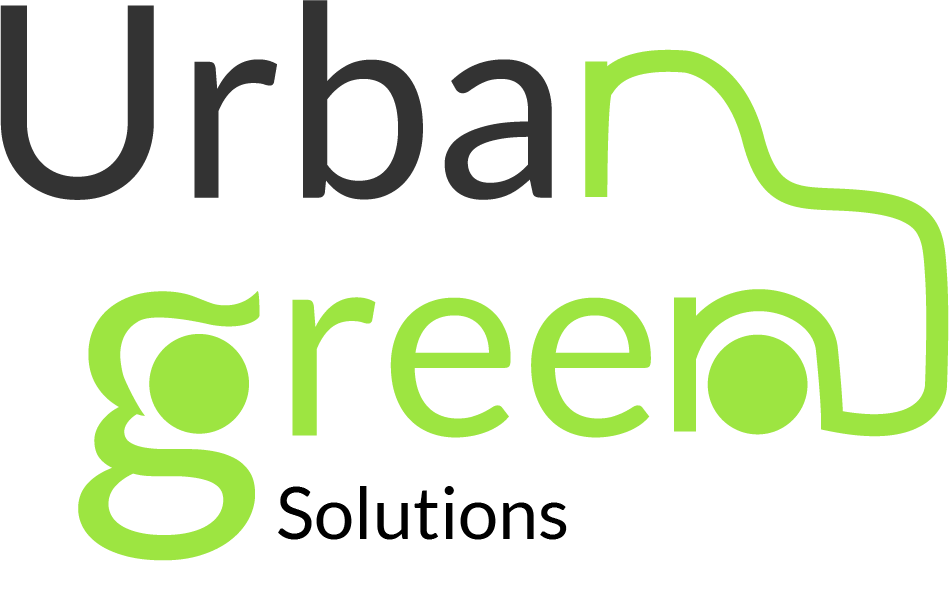
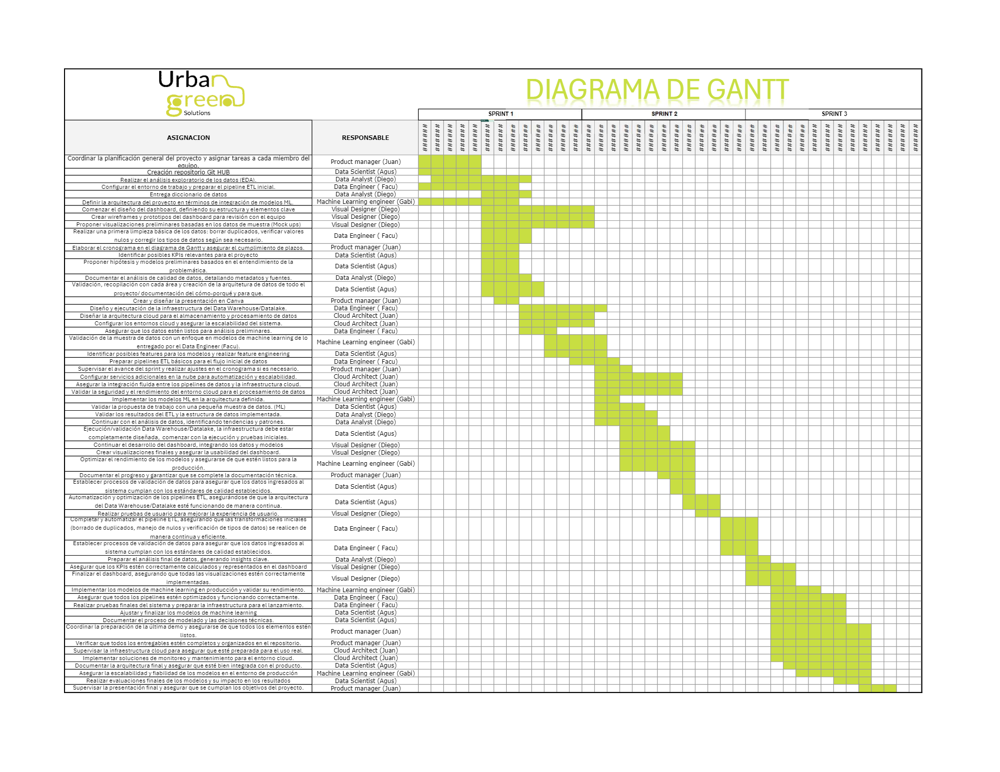

# ``` | ✏️ APP - BlueTrips ✏️ | ✏️ Urban Green Solutions ✏️ | 🟢 Data Scientist 🟢|🔵 Data Engineer 🔵|🟢 Data Analytics 🟢|🔵 Business Intelligence 🔵|🟢 Cloud Arquitect 🟢|🔴 Taxis NY 🔴 | 🚀 Henry 🚀 ```


<p align=center><p>

# <h1 align=center> **PROYECTO FINAL - Grupo 4 (Data PT 09)** </h1>

# <h1 align=center>**`Análisis Integral del Sector de Transporte de Pasajeros en Nueva York`**</h1>

<p align="center">

</p>

<hr>  

## **Descripción del proyecto**


## Contexto

En la ciudad de nueva york existen miles de taxis en servicio de manera continua. Existen tres tipos diferentes de taxis: Amarillos, Verdes y Negros. Cada tipo de taxi tiene sus zonas designadas; el amarillo es el único que puede subir y bajar pasajeros en Manhattan, por ejemplo. Para esto, los taxis amarillos tiene que comprar su registro de habiltitación para poder otorgar dicho servicio en esta zona, que además, es por mucho, la de mayor caudal de pasajeros y por ende, la más rentable. Este registro ha llegado a valer un millón de dolares antes de la aparición de Uber; hoy fluctua entre los 200 mil dolares. Esto generó un conflicto por los registros de habilitación para taxis amarillos.
Por otro lado, en 2021, a cuasa de la crisis ambiental, el presidente Biden aprobó una ley que busca renovar los taxis por modelos modernos con combustibles de energía alternativa, con el fin de reducir el impacto ambiental de este servicio de transporte. En nueva york, existen diversas estaciones de energía electrica -principal energía alternativa en el país-, lo que hace operativamente posible el objetivo de la ley: un recambio total de los automóviles para finales el 2025. Actualmente los taxis amarillos se encuentran en crisis, debido a que los taxis particulares como Uber, captan sus clientes y no les permiten subir la tarifa a un valor que les resulte rentable para pagar los prestamos que sacaron para comprar las habilitaciones. Por esto, los taxis verdes (que trabajan fuera de Manhattan), son los que aún permiten el ingreso de nuevos servicio, pero ¿de què manera se podría realizar de una manera rentable?. En este trabajo buscaremos responder esta pregunta clave.

## Público Objetivo
Empresa de transporte de pasajeros a larga distancia que busca introducir taxis en Nueva York.

## Propuesta de sectorización del negocio
Creemos conveniente para esta empresa que busca ingresar a otorgar servicios de taxis, introducir su servicio específico para los pasajeros de los servicios de transporte de larga distancia (autobuses y aviones). Actualmente pasan por los aeropuertos de nueva york, más de 10 millones de pasajeros por mes (13 millones en julio de 2024, ver Fuente *). Esto permitiría captar una zona del mercado lo suficientemente grande y que aún no posee la competencia y la sobreoferta presente en el servicio actual de taxis convencionales.

[fuente](https://www.panynj.gov/airports/en/statistics-general-info.html)*

## Perfil diferenciador del negocio
Hemos hecho incapié en ser ecológicamente activos a la hora de pensar el nuevo servicio de taxis. Por esto, creemos que nuestro diferencial, respecto a otros servicios de transporte que captan clientes en los aeropuertos, debe que provenir desde esta búsqueda; tanto para los usuarios como para la empresa de taxis. Desde el punto de vista de la empresa, también resulta de gran utilidad y eficiencia económica, porque conocer o estimar el número de clientes para poder ingresar al aeropuerto/terminal sólo con las unidades necesarias permitiría eliminar las esperas inútiles y los lapsos de actividad no rentados.

## Propuesta General

Crear una app que asocie a los pasajeros que hacen caminos similares o van a destinos en las mismas zonas de NY, para recomendarles viajes compartidos en taxis eléctricos que permitan un servicio cómodo, de menor costo y más comprometido ecológicamente, ya que permite ayudar a reducir congestiones de tráfico, ruido ambiente y, sobre todo, la huella de carbono. :muscle:


## **Análisis Propuesto:**
Conocer las oportunidades, costos y posibles ganancias de un nuevo servicio de taxis en la ciudad de Nueva York.
  
## **Objetivos Puntuales:** 
Teniendo en cuenta la información de estaciones de carga eléctrica, el modelo y el rendimiento de vehículos, los costos del combustible, impuestos y peaje, las zonas más congestionadas y sus restricciones legales, nos planteamos poder recomendar un tipo de servicio rentable que, además, esté planteado con facilidades para el despliegue de un negocio con proyección. Incluyendo una APP para la reserva y la recomendación de los mejores caminos posibles para el taxi y modelo de recomendación para acompañantes manejado por el usuario, quien además podrá conocer el ahorro de su huella de Carbono gracias al uso de sservicio de viajes compartidos.
  
## **Alcance del proyecto**
Generar un respaldo de datos, estructura y stack tecnológico para la inteligencia suficiente durante el despligue y puesta en marcha del negocio planteado. Una vez operativo el serivicio, la aceptación del serivicio y el crecimiento de usuarios dependerá de factores no tratados en este análisis (publicidad, presencia institucional, calidad del serivicio, por ejemplo).

## **Propuesta comercial del trabajo**
Todo viajero o viajera desea llegar y tener resuelta la lelgada al hotel, o el regreso a su casa. Luego de un larguísimo viaje entre aeropuertos, o durante horas enteras en la ruta, aún no hemos llegado al destino. Aún falta el último paso. Aún puede que nos cobren más de lo que corresponde, que nos lleven por el camino más largo, que sea tarde y no consigamos servicio, que todos los taxis estén ocupados y la espera y el viaje se alargue aún más, etc. Nada resultaría más útil que poder resolverlo con facilidad, claridad y confianza. Por esto, AirTaxi crea una solución: facilitar el último paso de tu viaje.


**Detalles Técnicos ( Diego)**

# ✔️```Ciclo de vida del dato``` 
Conocer cual es el camino que siguen los datos dentro de cualquier proyecto es crucial para entender su procedencia y aprovechar al máximo su presencia, por ello se presenta un gráfico que indica a detalle los caminos a seguir de los diferentes datos que ayudan a sustentar el presente proyecto por ello se explica el proceso a coninuación:

Explicación del ciclo de vida completo en la nube
- Ingesta de datos: Los datos crudos se cargan automáticamente en Cloud Storage o se leen de APIs mediante Cloud Functions.
- Transformación y carga: Usando Cloud Composer y Dataflow, los datos se limpian, transforman y cargan en BigQuery.
- Validación de datos: Airflow orquesta la ejecución de las tareas y realiza verificaciones automáticas para asegurar la integridad de los datos.
- Almacenamiento: Los datos transformados se almacenan en BigQuery para su uso en análisis, ML o dashboards.
- Machine Learning: Los modelos se entrenan localmente o en AI Platform, luego se despliegan como servicios para ser usados en aplicaciones.
- Dashboards: se realiza conexión cn power bi a ttabves de BigQuery para su ingesta y su posterior análisis.


# 1. ✔️```Análisis preliminar de la calidad de los datos (EDA)``` 

Bajo la misma línea de pensamiento de Urban Green Solutions, sin perder de vista los objetivos planteados en el proyecto y con la finalidad de obtener un panorama real del estado y los retos a los que nos enfrentamos, se realiza un análisis preliminar de los datos:
Para ello se extraen de las Agencias gubernamentales NYC Taxi and Limousine Comisión y Environment & Health de New York datos reales y actuales útiles para trabajar este proyecto.


El análisis consta de 6 sets de datos:

a. **Electric and Alternative Fuel Charging Stations:** Este dataset contiene información sobre las estaciones de carga de combustibles alternativos para vehículos (electricidad, Gas Natural, Gas Licuado, Gas de biodigestores, Etanol e hidrógeno) en EE.UU., después de analizar los datos se obtuvieron los siguientes insights:
    - Existen gran cantidad de nulos por columnas especificas de cada tipo de combustible, sin existir problema filtrando data.
    - Casi 60k estaciones son destinadas para todo publico
    - Mas de 45k estaciones abren las 24 horas 
    - Mas de 10k estaciones de carga ofrecen carga de vehículos eléctricos de forma gratuita y otras más solo cobran tiempo de estacionamiento
    - En NY existe un total de 3409 estaciones de carga para vehículos eléctricos y mas de 600 ofrecen servicio gratuito. 17%.


b. **Vehículos ligeros:** Este dataset contiene información adicional de 1993 a 2022 sobre vehículos ligeros (autos a camionetas hasta 2.7 ton) en él se almacenan datos referentes a tipo de combustible eficiencia de combustible alternativo (ciudad, carretera y combinado), los datos más importantes son:
    - La fábrica predominante es Ford
    - La categoría de estos vehículos predominante es sedan/wagon y le sigue SUV
    - Casi 15% son vehículos eléctricos.


c. **Electric Car Data:** Con la finalidad de apegarse a la normativa en NY, se analiza este set de datos que contiene la información de los autos eléctricos disponibles en el mercado de EE.UU. La información relevante contenida es:
    - No existen datos nulos 
    - Existen información de marca, modelo, eficiencia, autonomía, Precio, entre otras 
    - Existen outliers en eficiencia y precio


d. **Taxy-zones:** Con la finaldad de estudiar y conocer las zonas en donde transitan los taxis en NY se analiza este dataset, el mismo contiene la siguiente información: 
    - Las ciudades de New York
    - Áreas o espacios de zonas de taxis
    - Longitud de recorridos
    - Zonas de aeropuertos


e. **Vehicle fuel Economy Data:** Este dataset contiene información acerca de la economía y emisiones de CO2 del combustible tradicional y alternativo en un periodo comprendido de 1984 a 2023. La relevancia de los datos es:
    - 120 gr/milla de emisiones en promedio por auto de combustible tradicional contra 0 gr/milla de vehículos electricos
    - Casi $3k dólares contra $15.36 el promedio de comparación de costos de combustibles


f. **AirQuality:** Calidad del aire: Dentro de este dataset se encuentran valores que miden la calidad del aire de acuerdo a una tabla con la cual se compara la concentración de contaminantes, medidos en µg/m3, así como registros de temporalidad por hora, día, mes y de requerir por año. Junto a este set de datos se analizan datos que contiene información sobre las ubicaciones de las mediciones:
    - No nulos
    - Valor máximo: 265.21
    - Valor mínimo: 2.19
    - Promedio: 9.88
    - Asimismo, se pudo observar que los horarios del día en que existe menor calidad de aire son de 12 a 17 horas


**Conclusión:**  
    Confiabilidad: 
        - Alta por venir de organismos públicos
    Problemas detectados: 
        - Gran cantidad de datos tiene nulos, solo en algunos datasets por ser datos de vehículos específicos
        - Buena variabilidad:

Para una mejor visualización de los análisis preliminares a detalle se sugiere ver en los notebooks del EDA [link EDA](https://github.com/AgustinNiederle/ProyectoFinalHenry_AirTaxis/tree/main/EDAs), los datos nos entregan información elocuente sobre tipo de tenologías convencionales y alternativas, su disponibilidad en la cuidad, tipo de vehículos por modelo, eficiencia y costos, como también el funcionamiento convencional del servicio.

# 2. ✔️```Extracción transformación y Carga (ETL)``` 
El proceso de ETL es crucial puesto que permitirá alimentar la aplicación de todos los datos necesarios para llevar a cabo su respectivo análisis. El proyecto en esta etapa integra los set de datos al entorno de GCP, mediante una estracción de datos del DataLake de los organismos públicos antes mencionados, posteriormente se realiza una limpieza profunda de los datos que son indispensables para la unidad de negocio y respecto a las decisiones tomadas, los datos extraidos, filtrados y limpiados pasan a cargarse en la tecnología Big Query de GCP, con ello pueden ser consumidos desde otros entornos, herramientas y visualizaciones para satisfacer las necesidades del cliente final.

## estructura de la DB 
La base de datos que se construye es muy importante así como su estructura por lo que darla a conocer es medular en el proyecto, a continuación se muestra la estructura de esta Base de Datos construida:


# 3. ✔️```Modelos de Machine Learning``` 

Al asociarnos con las empresas de bus (incluso la propia) y las de aviones, se podrí captar a clientes antes de que toquen la pista de aterrizaje usando una APP que les permita reservar su viaje, identificando la zona de destino: esto permitirá sugerir al usuario los compañeros de viaje según el destino y otras preferencias a indicar en la misma (primer modelo ML) y tambien, los caminos óptimos al chofer del Taxi en cuestión (segundo modelo ML). 
Consiguiendo los datos de vuelos y de empresas de transporte de larga distancia, para conocer el número los pasajeros que llegan a NY por día y horario, podemos estimar la cantidad de usuarios potenciales. Al conocer el costo de enería electrica por auto por hora, podríamos tener valores certeros del negocio.

La implementación del modelo de machine learning en este proyecto busca predecir los costos de los viajes que dos o más usuarios tendrán que pagar, para ello es indispensable la hora de inicio y la hora de finalización del vieje así como la distancia del recorrido. Este modelo permite estimar y predecir como se comportarán los posibles clientes ante la construcción del negocio y de esta forma conocer con un grado de probabilidad que futuro tendrá la unidad de negocio.

### ✔️```Resultados```


## `KPIs` propuestos:

+ a KPI 1: Incrementar un 1% mensual en el uso de servicios de autos compartidos.
Descripción: este KPI permite conocer el comportamiento del uso de autos compartidos del negocio Blue Trips.

+ b KPI 2: Incrementar un 3% mensual en el total de los ingresos por el servicio de uso de autos compartidos.
Descripción: Un factor importante en cualquier tipo de negocio es conocer como se comportan los ingresos, de esta manera se busca realizar adecuaciones y tomar decisiones respecto al valor de este indicador, por lo que analizarlo constantemente ayuda a conocer el estado del negocio.

+ c KPI 3: Incrementar ganancia de un 20% bimestral respecto a las inversiones en la flota de x vehículos eléctricos por el servicio de transporte en autos compartidos.
Descripción: Cualquier negocio necesita tener rendimientos rentables en sus ingresos por lo que para este KPI se pretende conocer como se comportan las ganancias respecto a las inversiones que se realicen.


# 3. ✔️```Dashboard - pantallas de visualización de datos``` 
Los dashboard son indispensables para resumir, visualizar y tomar acción oportuna respecto a la data, es por ello que en esta etapa del proyecto se presenta un dashboard interactivo que ayudará a realizar esas tareas. 
Este dashboard contiene información de vehículos eléctricos como: marca, modelo, autonomía, eficiencia, precio, entre otras. Así mismo contiene infrormación de las estaciones de carga para vehículos eléctricos de la ciudad de Nueva York, análisis de los ultimos viajes de taxis amarillo de Nueva York, para estos datos es menester mencionar que sólo se tienen viajes de los 3 aeropuertos existentes en la ciudad, puesto que ahí se enfoca principalmente el negocio y por último un analisis de los KPI´s propuestos que se describierón líneas arriba.


### ✔️```Resultados```


<br/>


**Staff:**
- Juan Aponte - Product Manager/Cloud Arquitect
- Facundo Dispenza - Data Engineer
- Agustín Niederle - Data Scientist
- Gabriel Cañete - Machine Learning Engineer
- Diego Camacho - Data Analyst


- **Cronograma general del proyecto (Gantt):**
<p align="center">

</p>
[link](https://docs.google.com/spreadsheets/d/1AQ29tg_Rf70jkreNERpkFYWSLuZHVaZXYMhSw0qgopQ/edit?gid=0#gid=0)
</p>
